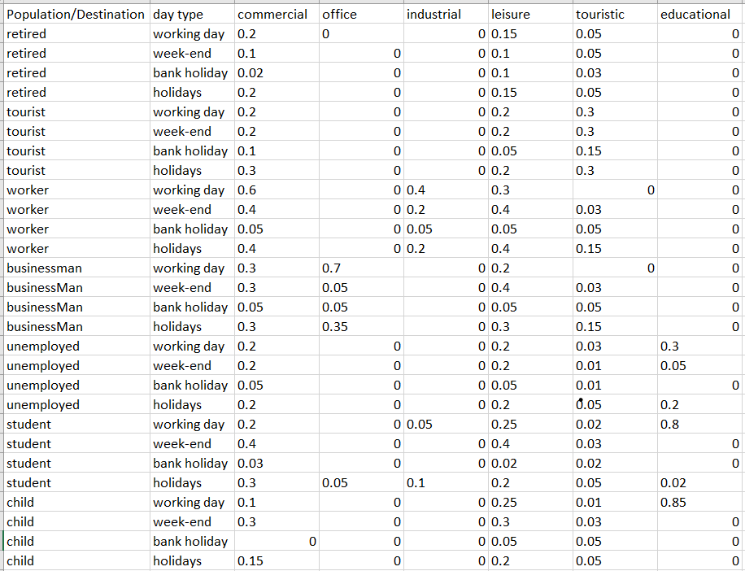

## Unfinished functionalities

## Introduction

This document describes the unfinished functionalities of the project.
There are 4 unfinished functionalities:

- Trains management
- ClosedLine events
- Population realism
- Multiple days enhancement

Then, 2 more elements will need some work to resolve the issues raised by them:

- Concurrency use
- Licences

## List of branches to keep

The following branches should be kept because they have some work that is not
finished (work described in this document) so are not merged into the dev
branch. Also, these branches have not been actualized with the master branch
since they have been created. Therefore, do not forget to actualize them with
the master branch before merging them into the dev branch.

Here is the list of the branches to keep:
- sim_11_ptre (US #11: "end of the simulation enhancement")
- red_42_mbor (US #42: "I want to be able to create an event for a line closure")
- sim_9_acha (US #9: "Orient the different types of people to the different
types of zones")
- sim_red_15_39_bbel (US #15: "Simulation over multiple days"
and US #39: "Change the type of day for each day of the simulation in the HMI")

### 1. Progress status of the train management

#### 1.1. Introduction

This part of the document describes the progress status of the branch
sim_11_ptre.
The branch sim_11_ptre was created to work on the US #11: "end of the simulation
enhancement".
The work done on this branch was divided into 2 parts:

- being sure that all the passengers have exited the stations at the end of the
  simulation;
- being sure that all the passengers have exited the trains at the end of the
  simulation.

The first part has been successfully implemented, tested, so it already has been
merged into the dev branch.

The second part is still in progress. A major part has been done but due to the
current line and train functioning, it is not possible to finish it.

In fact, the structure need an important change because the notion of terminus
is not understood by the simulation.

Therefore, this document describes the work that has been done so far and the
work that still needs to be done.
The objective is to have a clear view of the work that still needs to be done
in order to allow the following developers to continue the work on this branch.

#### 1.2. Work

##### 1.2.1. Passenger exiting the stations

The first part of the work was to be sure that all the passengers have exited
the stations at the end of the simulation.
This part has been successfully implemented and tested.

The work done is the following:

- Creation of the function StationExitPop() in populationManager.go. This
  function transfers all the passengers from the station to the outside.
- Creation of the function AllStationExitPop() in populationManager.go. This
  function calls the function StationExitPop() for all the stations.
- At the end of the function Run() in simulator.go, the function
  AllStationExitPop() is called.
- The file metro_simulator_test.go has been added. This file contains the unit
  tests for the functions created in populationManager.go in this branch.

To verify the integrated tests, the following work has been done:

- Creation of the functions IsStationEmpty() in populationManager.go. This
  functions return true if the station is empty.
- Creation of the function checkNetworkNotEmpty() in metro_simulator.go. This
  function calls the function IsStationEmpty() for all the stations and returns
  the number of stations that are not empty.
- Creation of the function checkPassengersInNetwork() in metro_simulator.go.
  This function returns the number of passengers in the stations.
- At the end of the function Main() in metro_simulator.go, so at the end of
  the simulation, the functions checkNetworkNotEmpty() and
  checkPassengersInNetwork() are called.
- Then the results are displayed.

##### 1.2.2. Passenger exiting the trains

The second part of the work was to be sure that all the passengers have exited
the trains at the end of the simulation.
This part is still in progress.

First, modifications have been done to the functions used to verify the
integrated tests.

To verify the integrated tests, the following work has been done:

- Creation of the function IsTrainEmpty() in populationManager.go. This
  functions return true if the train is empty.
- Creation of the function checkTrainsOnRail() in metro_simulator.go. The goal
  of this function is to check if there are still trains that did not reach the
  terminus.
- Modification of the function checkNetworkNotEmpty() in metro_simulator.go.
  This function now also calls the function IsTrainEmpty() for all the trains
  and
  returns the number of trains that are not empty.
- Modification of the function checkPassengersInNetwork() in metro_simulator.go.
  This function now also returns the number of passengers in the trains.
- At the end of the function Main() in metro_simulator.go, so at the end of
  the simulation, the function is called.
- Then the results are displayed.

Then, the following work has been done:

- Creation of the function TrainExitPop() in populationManager.go. This
  function transfers all the passengers from the train to the station.
- Creation of the function AllTrainsExitPop() in populationManager.go. This
  function calls the function TrainExitPop() for all the trains.
- At the end of the function Run() in simulator.go, the function
  AllTrainsExitPop() is called.

###### 1.2.2.1. First version & the major issue

Also, a modification has been done to the function RunOnce() in simulator.go:

- For each train checked, if the next station is terminus and if it does have
  time to reach the other terminus before the end of the simulation, the train
  is launched. Otherwise, the train is stopped when it reaches the terminus.

Precision: The function check the trains before they left the precedent station.

Here, we can observe a major issue. The trains can not really "stop". This is
due to the initial structure. At first, a try to tell the trains to travel from
a terminus to the same terminus, in order to make them stop, has fail because
the simulator will soft-block himself.

Therefore, a first version has been done. In this version, the trains will do a
really long last travel in order to arrive just at the end of the simulation.

For example:

- A train leave the penultimate station at 23:50:00.
- The simulation stop at 23:59:00.
- The travel between the penultimate station and the terminus last 5 minutes.

In this case we will force the train to arrive at the terminus at 00:00:00 and
not at 23:55:00 as it should be.

In fact, this version worked. The integrated tests were successful. But this
version is not really satisfying because the trains do not have a realistic
comportment.

###### 1.2.2.2. US #26: Adjust the number of trains and their spacing in the line

The US #26 has not been implemented for the moment. But the exploration of this
US has been started. The goal is to be able to adjust the number of trains and
their spacing in the line.

The problem is that the number of trains per line is fixed. This number is
defined in the file config.json. Also, due to the current functioning (the fact
that the trains can not stop at the terminus), trains can not be added or
removed so the spacing between the trains can not be changed.

The goal to resolve this issue is to implement the notion of terminus. This
notion is not understood by the simulation for the moment.
With this notion, the terminus will be able to stock trains.

Another one issue is the fact that trains events start when trains arrive at the
station and end when they leave the station. This event is generated just before
train finish the previous one, so just before the train leave the precedent
station.

###### 1.2.2.3. Solution began

So, the major issue is the structure of the line and the trains. The trains
should be able to stop at the terminus. This is not the case for the moment.

To resolve this issue, we want to implement the notion of terminus. This notion
is not understood by the simulation for the moment.

Also, due to the current functioning of the NextEventTrain() function in
simulator.go, here is how the solution should be implemented:

- What we want is to have a train that stay in garage until the time to leave
  the terminus.
- When leaving the penultimate station, the simulation will ask the terminus
  when the train will be relaunched. So the next event of this train will start
  when the train arrive at the terminus and will stop when the train leave the
  terminus.
- When the train arrive at the terminus he will be stock in the terminus. The
  train will not be able to take new passengers until x minutes before the time
  to leave the terminus.
- x will be determined by the simulator depending on the spacing between the
  trains.
- The "spacing between the trains" parameters will be written by the user in
  config.json.
- Five spacing will need to be set:
    - From the beginning of the simulation to the beginning morning rush hour.
    - From the beginning of the morning rush hour to the end of the morning rush
      hour.
    - From the end of the morning rush hour to the beginning of the evening rush
      hour.
    - From the beginning of the evening rush hour to the end of the evening rush
      hour.
    - From the end of the evening rush hour to the end of the simulation.
- The "number of trains per line" parameter will be removed from config.json. It
  will be replaced by the 5 "spacing between the trains" parameters.
- The metroTerminus.go file will be created.
    - This file will contain the structure MetroTerminus with 4 parameters:
        - The id of the MetroStation.
        - The trains that are stocked in the terminus.
        - The spacing between the trains. This is a list of the 5 spacing
          between the trains that are calculated depending on the 5 "number of
          trains per line" parameters. To calculate the spacing between the
          trains, the simulation will use the number of trains per line and the
          travel time between the terminus.
        - The time of the last launch attributed to a train.
    - This file will contain the functions that will allow the simulation to
      understand the notion of terminus.
    - The parameters of this structure
- A parameter (called "isInGarage" for example) should be added to the
  structure MetroTrain in metroTrain.go. This parameter will be a boolean that
  will be true if the train is in a terminus and false if the train is not in a
  terminus.
- isInGarage parameter will be checked when the train is in terminus in order to
  know if the train allow new passengers to enter the train or not.
- Every time a train arrive at a terminus, the function AllTrainsExitPop() in
  populationManager.go will be called in order to be sure that no passenger is
  still in the train when it is stocked in the terminus.

#### 1.3. Conclusion

The first part of the work has been successfully implemented and tested. It has
been merged into the dev branch.

The second part of the work is still in progress. A major part has been done but
due to the current line and train functioning, it is not possible to finish it.

In fact, the structure need an important change because the notion of terminus
is not understood by the simulation.

Therefore, the team as work on the solution to implement the notion of terminus
and to be able to finish the second part of the work. This work as been started
but not finished. If the followings developers want to continue the work on this
branch, they should use this solution which appears to be the best one.

Of course, this solution is not perfect. For example, the performance of the
simulation is not satisfying with the current NextEventTrain() function in
simulator.go. But this solution is the best one that we have found for the
moment. But even with a new functioning, few adaptation of this solution
will be needed.

### 2. ClosedLine events

#### 2.1. Introduction
This part of the document describes the progress status of the implementation of the ClosedLine events.
This features has been divided into 3 parts :
- The creation of a line closed event on the HMI;
- The implementation of an unexpected line closed event in the simulator;
- The implementation of a planned line closed event in the simulator.

The first part has been successfully implemented, and tested, but it is not functional yet on the dev branch.
However, we will explain how to fix it in this part.

The second and third parts are not implemented yet, but we will explain what we thought of for it.

#### 2.2. Work

##### 2.2.1. Creation of a line closed event on the HMI

###### 2.2.1.1 How to make it functional

The first part of the work was to be able to create a line closed event (planned or unexpected) on the HMI.
This part has been successfully implemented and tested, but it is not functional yet on the dev branch.
However, to fix it, in the file ListEventPanel.java, we need to add an element in the TABLE_DATA array
(lines 202 to 211), which will be the line closed event.

Currently, it looks like this :
```java
private static final Object[][] TABLE_DATA = {
      {"LineDelayed", EVENT_TYPE_LINE,
              "configure a delay between 2 stations of a line"},
      {"StationClosed", EVENT_TYPE_STATION, "close a station"},
      {"MultipleStationsClosed", EVENT_TYPE_LINE, "close multiple stations of the map"},
      {"GaussianPeak", EVENT_TYPE_STATION,
              "configure an attendance peak with a gaussian distribution"},
      {"RampPeak", EVENT_TYPE_STATION,
              "configure an attendance peak with a ramp distribution"},
      {"TrainHour", EVENT_TYPE_LINE, "configure a new train flow on a line"}};
```
We need to add this in the array :
```java
{"LineClosed", EVENT_TYPE_LINE, "close an entire line of the map"}
```
It would look like this :
```java
private static final Object[][] TABLE_DATA = {
      {"LineDelayed", EVENT_TYPE_LINE,
              "configure a delay between 2 stations of a line"},
      {"StationClosed", EVENT_TYPE_STATION, "close a station"},
      {"MultipleStationsClosed", EVENT_TYPE_LINE, "close multiple stations of the map"},
      {"LineClosed", EVENT_TYPE_LINE, "close an entire line of the map"}
      {"GaussianPeak", EVENT_TYPE_STATION,
              "configure an attendance peak with a gaussian distribution"},
      {"RampPeak", EVENT_TYPE_STATION,
              "configure an attendance peak with a ramp distribution"},
      {"TrainHour", EVENT_TYPE_LINE, "configure a new train flow on a line"}};
```
###### 2.2.1.2 How it works

Once it works, we will be able to create a line closed event on the HMI.
In the Event-editor, we can choose the type "Line Closed", then we have to choose the start end date, the line concerned
and the type of closure (planned or unexpected).

When we export the XML file, the line closed event is added in the "events" element of the XML file.

For a planned line closed event the element looks like this :
```xml
<lineClosed>
    <start>2024-01-17T23:32:00.000Z</start>
    <end>2024-01-24T23:32:00.000Z</end>
    <idLine>0</idLine>
    <closureType>planned</closureType>
</lineClosed>
```
And for an unexpected line closed event the element looks like this :
```xml
<lineClosed>
    <start>2024-01-17T23:32:00.000Z</start>
    <end>2024-01-25T23:32:00.000Z</end>
    <idLine>1</idLine>
    <closureType>unexpected</closureType>
</lineClosed>
```
##### 2.2.2. Implementation of a line closed event in the simulator

We have defined two types of line closed events :
- Planned line closed : this event correspond to a line closure that would be planned in advance so the trains would
stop at the terminus.
- Unexpected line closed : this event correspond to a line closure that that would occur unexpectedly, in the case of a
breakdown for example. In this case, the trains would stop at the nearest station or even between stations.

For now, the line closed event is not handled by the simulator, but we thought about how to implement it.

First, we need to create one or several classes to handle the line closed event. Here are two possibilities :
- Create an abstract class LineClosedEvent that would be the parent class of two classes PlannedLineClosedEvent and
UnexpectedLineClosedEvent.
- Create one class LineClosedEvent with an attribute "type" that would be "planned" or "unexpected".

Then, we need to add a case when the simulator is analysing the xml file to create the line closed event in the
simulator.

To implement the line closed our idea is to handle the event directly when the simulator calculate the schedule of the
trains in the call Timetable.
Depending on the type of event we would have different behavior.

###### 2.2.2.1 Planned line closed event
As the name suggests, this event would be planned in advance, so the trains would stop at the terminus and the
passengers would go out the trains, at they usually do at a terminus.
When the simulator will calculate the schedule of the trains, if there is a line closed event,
the simulator will check if the train has the time to arrive at the end of a line before the closure of the line.
If it is not the case, the train will stay at the terminus.

###### 2.2.2.2. Unexpected line closed event
On the contrary, this event would be unexpected, it would correspond to a short-term closure of a line so the trains
would have several possible behaviors :
- If the train is already at a station, it would stay at this station;
- If the train is between two stations and the next station is empty, it would go and stop to this next station;
- If the train is between two stations and the next station is not empty, it would stop between the two stations.

In all cases, the passengers would not be able to go out the train, so they would stay in the train until the end of
the event.

#### 2.3. Conclusion

The first part of the work has been successfully implemented and tested, but it is not functional yet on the dev branch.
However, it can be fixed by adding an element in the TABLE_DATA array in the file ListEventPanel.java.

The second and third parts are not implemented yet, but we thought about how to implement it. 

### 3. Progress status of the population realism

#### 3.1. Introduction

The main problem with the simulator is the random nature of the population's
movements, more specifically that the routes generated are random.
For example, the probability of a person travelling to a lightly used station
is the same as the probability of a person travelling to a station in the city
centre. the same as the probability of a person travelling to a station in the
city centre, for example.
A system has been put in place in previous teams to have 'commute hours' to
simulate work-related rush hours.
The aim of this US is therefore to remodel the current system to generate
more consistent journeys for any type of day and any type of traveller.

#### 3.2. Elements in place

To do this, on the GUI side, we can modify the distribution of stations in an area.

Version v2 introduces areas that can group together several stations, and gives
each station in the area destinations distribution:
- Residential
- Commercial
- Office
- Industrial
- Touristic
- Leisure
- Educational

Another population distribution has been introduced in v3:
- Student
- BusinessMan
- Worker
- Child
- Retired
- Unemployed
- Tourist

  If the station is not in an area, then we take default values
  (100 / number of fields and some rounded to keep them whole numbers).

#### 3.3 Work

##### 3.3.1 Probabilities of having some trips for each type of person depending on the type of day

To generate routes for passengers, a
[csv spreadsheet](../../../../network-journey-simulator/src/configs/orientation_coefficients_csv.csv)
was created. This spreadsheet contains the probabilities of having some trips
for each type of person depending on the type of day.

Here's an example:
For a student on a working day, there is a 30% chance that he will have a
trip to go to a commercial area, a 5% chance that he will have a trip to go
to an industrial area, a 25% chance that he will have a trip to go to a
leisure area, a 2% chance that he will go to a tourist area, and an 80%
chance that he will go to an education area.

These percentages were imagined, there is no source from which the
probabilities come. Research has been done, but it's quite difficult to
determine, bearing in mind also that these probabilities can change from one
culture to another, from one country to another. This file is in the configs
folder with the other existing configuration files and the customer can modify
the values to match their desired model.

<div style="text-align: center;">
    <figure>
      
    </figure>
  <figurecaption>CSV file with orientation coefficients</figurecaption>
</div>

##### 3.3.2. New function for generating the passengers trips in populationManager.go

The basic NewPopulation function generates a proportion of the population as
passengers who will have random trips and another proportion who will
participate in the morning and evening peak times. These proportions can be
found in the [config.json](../../../../network-journey-simulator/src/configs/config.json)
file:
```json
"population commuters proportion": 0.7,
"population randoms proportion": 0.3,
```

In the [populationManager.go](../../../../network-journey-simulator/src/models/populationManager.go)
file of the branch sim_9_acha, a new function called NewPopulation2 has been
created and should eventually replace the NewPopulation function.

In this function, some calculations are made:
- The sum of all the percentages of each population type
- The sum of all the percentages of each destination type
- The total percentage of the model (equivalent of the 100% for us)
- The proportion of each population type
- The proportion of each destination type
- Probability for each station that a person lives there depending on their type
- Probability for each station that a person goes there depending on their type

##### 3.3.3. Modification of the tourism attribute, residence problem
However, a problem has been detected:

Tourists spend their nights in commercial areas, not residential areas, but
they do play a part in the calculations and therefore distort them slightly.
Several solutions have been devised to exclude them from the calculations, but
the simplest solution is to remove them from the population distribution in
the GUI and add a parameter to the
[config.json](../../../../network-journey-simulator/src/configs/config.json)
to determine the overall number of tourists. This part has been  done on the
HMI side and still needs to be implemented on the simulator side (in terms of
json decoding, since the tourist attribute no longer exists, and the default
values have changed, see the
[Area.java](../../../../railway-editor/src/main/java/org/example/model/Area.java)
file for these values).


The probability for each station that a person lives there depending on
their type is also wrong because it's not pondered by the residential
percentages in the stations.


##### 3.3.4. Bugs fixed

In this branch, several bugs have been fixed on the GUI side. Several of these
dated back to v2, and others appeared with our new implementation in v3.
Not all of them have been noted in the bug tracker, but here is a list of the
ones that have been noted:
- Right click can move elements
- When moving quickly the map or doing big zooming/dezooming, the elements
  move a lot
- The zoom bar is linked only to the map and not to the elements
- Areas don't export as expected : once export a network with 3 areas but
  only one was in the xml **(this one has been better fixed in the dev branch for
  the final master release)**

#### 3.4. What remains to be done

We need to redo the go code for the NewPopulation2 function to remove the
tourist field from the distribution population and recalculate the number of
people for each population type.

Then, the probability for each resort that the person lives there has not been
calculated according to the residential percentage of each resort.
We therefore need to :
- Calculate the number of inhabitants per station using the residential
  percentages and the total of the residential percentages.
- Recalculate the proportion of each type of person in the population,
  weighted by the station's residential percentage. For example, if there are
  40% students in a station with only 10% residential, this doesn't necessarily
  represent more students than 20% students in a station with 40% residential.
- Recalculate the probability of residence in a station depending on the
  population type
- Use this to calculate the number of people per population type.
- Create the required number of passengers for each type.
- For each passenger, assign a residence based on the recalculated probability.
  Browse the csv line corresponding to the passenger type and the day type,
  and for each destination, if the random number generated is valid, generate
  a trip. Select a destination station using the map with the probability for
  each station that a person goes there depending on their type.

#### 3.5. Conclusion

The implementation has started and several phases of exploration have been
carried out for the different phases. During these exploration phases,
problems and potential solutions were determined and remain to be implemented.

I strongly advise you to take a paper or go to the whiteboard to simulate a
metro network of one line and 3/4 stations, write the values for the
distributions of each station and test the calculations to be implemented in
the code. This has already been done, but unfortunately I do not have photos
of the whiteboard when the explorations were made.


### 4. Multiple days enhancement

#### 4.1. Introduction

This part of the document describes the progress status of the branch
sim_red_15_39_bbel. The branch sim_red_15_39_bbel was created to work on the
US#15: "Simulation over multiple days" and the US#39: "Change the type of day
for each day of the simulation in the HMI". The work done on this branch was
divided into 2 parts:

- being able to change the type of day for each day of the simulation in the
  HMI.
- being able to run the simulation over multiple days and to apply the changes
    of the type of day in the simulation.

The first part has been successfully developed.

The second part is still in progress.

#### 4.2. Work

##### 4.2.1. Change the type of day for each day of the simulation in the HMI

The first part of the work was to be able to change the type of day for each
day of the simulation in the HMI.

Scenario nominal:

- The user launch the HMI.
- The user click on the **Edit** button.
- The user click on the **Parameters** button.
- The user choose the **start** and **end time** of the simulation.
- The user click on the **OK** button.
- The user click on the **Edit** button.
- The user click on the **Days type** button.
- The user can choose the **type of day** for each day of the simulation.
- The user click on the **OK** button.
- The user can see the changes in the **config.json**.

##### 4.2.2. Run the simulation over multiple days and apply the changes of the type of day in the simulation

The second part of the work was to be able to run the simulation over multiple
days and to apply the changes of the type of day in the simulation. This part is
still in progress.

You can already run the simulation over multiple days. But at end of a day and
at begin of a new day, the simulation doesn't reset his state. Indeed, stations
and lines are not reset. So, the objective is to run a simulation for each day
of the simulation.

The following work has to be done:

- You have to edit function main in **metro_simulator.go** to replace the actual
definition of day type in the simulator by the on in the config.json file.
- A function was begun to be created and the objective is to return a list
of business days of all days between the start and end date of the simulation. This function is in the file
**metro_simulator.go**. It is called generateDateRange. It is not finished yet.
- After you get the list of business days, you have to run the simulation for
each day of the list. You have to edit function main in **metro_simulator.go**
to do that (maybe a loop of the function Init and the function Run of the
simulator.go file).

#### 4.3. Conclusion

All the work to be done is essentially in the simulator. **WARNING**, the
save of the statitics with CSV functions have to be adapted to save all results
of simulators in the same file. 

### 5. Concurrency use

#### 5.1. Introduction

This part of the document describes the concurrency use in the project.

Currently, the concurrency is not used in the project. But, the concurrency
could be used in the project to improve the performance of the simulation.

#### 5.2. Concurrency use

The concurrency could be used in the project to improve the performance of the
simulation. In fact, the simulation is a succession of events. Each event is
executed one after the other. But, some events could be executed at the same
time. Therefore, the concurrency could be used to execute these events at the
same time.

GO is a language that is well adapted to the concurrency. Therefore, this
language have been chosen for this project. However, the first version of the
simulation has been done without it.

The part that need to be adapted to use the concurrency is the management of the
train events.

For example, during tests, two simulation were launched with the same amount of
passengers. The only thing that differ between the two simulations was the
number of lines. The simulations were parameterized to have 4 trains per line.
In the first simulation (with 2 line, so 8 trains), it took around 1 minute. In
the second simulation (with 50 lines, so 200 trains), it took around 30 minutes.

#### 5.3. Conclusion

Currently, the concurrency is not used in the project. But, the concurrency
could and should be used in the project to improve the performance of the
simulation.

This part might be the most difficult one to do. But, it is also the one that
will have the most impact on the performance of the simulation. Therefore, it is
recommended to do it as soon as possible.

### 6. Licences

#### 6.1. Introduction

This part of the document describes the licences used in the project.

Currently, there are 3 different licences used in the project:

- MIT for the MNJS;
- GPL for the module JMapViewer;
- ODBL for the library OpenStreetMap.

#### 6.2. ODBL

The library OpenStreetMap is under the ODBL licence. This licence do not cause
any problem for the moment. Therefore, no work is needed on this part.

#### 6.3. MIT & GPL

The MNJS is under the MIT licence and the module JMapViewer is under the GPL
licence. These licences are not really compatible. Therefore, a modification
should be done.

Three solutions are possible. The two first are easier technically but less
satisfying. The third one is more difficult technically but more satisfying.

##### 6.3.1. First solution

The first solution is to change the licence of the MNJS. This solution is not
satisfying because this licence is the one wanted by Thales. But, if this
solution is chosen, the MNJS will be under the GPL licence. If this solution is
chosen, the header of all the files of the MNJS will need to be modified.

##### 6.3.2. Second solution

The second solution is to stop using the module JMapViewer and to use another
map module. This solution is complicated because the module JMapViewer is
integrated in the MNJS. Therefore, a lot of work will be needed to replace this
module.

##### 6.3.3. Third solution

In fact the two licence can be compatible. The GPL licence is a copyleft
licence. This licence impose that the software that use the module JMapViewer
must be under the GPL licence. But the MIT licence is a permissive licence. This
licence impose that the software that use the MNJS can be under any licence.

Therefore, the two can work together if the communication between the two is
done in a specific way. But, to do this, an expertise is needed. Student working
on this project do not have the expertise to do this. Therefore, a work with
Thales will be needed to do this.

### 6.4. Conclusion

Currently, the MNJS is under the MIT licence and the module JMapViewer is under
the GPL licence. These licences are not really compatible. Therefore, a
modification should be done.

Three solutions are possible. The last one look to be the one to be chosen. But
an expertise is needed to do this. Therefore, a discussion with Thales will be
needed to do this.