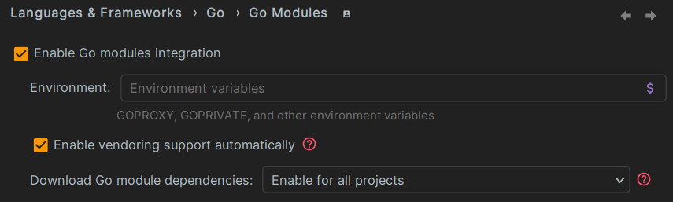

# MNJS installation manual

## Introduction

The purpose of this document is to help users through the installation of the MNJS simulator and
HMI.

## Summary

- [MNJS installation guide](#mnjs-installation-guide)
    - [Introduction](#introduction)
    - [Summary](#summary)
    - [Prerequisites](#prerequisites)
      - [Git](#git)
      - [Go](#go)
      - [Java](#java)
      - [Power BI](#power-bi)
    - [Installation Steps](#installation-steps)
      - [Clone the Project](#clone-the-project)
      - [Open the Project](#open-the-project)
      - [Initialisation of the simulator](#initialisation-of-the-simulator)
      - [Initialisation of the HMI](#initialisation-of-the-hmi)
    - [Others](#others)
      - [Sonarlint](#sonarlint)
      - [Checkstyle](#checkstyle)
      - [SonarQube](#sonarqube)


## Prerequisites

### Git

- The actual version of Git in the project is **2.38.1**

To install Git, you need to go to the [Git website](https://git-scm.com/downloads)
and download the appropriate version for your operating system.

### Go

- The actual version of Go in the project is **1.21.1**

You can install Go through your preferred integrated development environment
(IDE) by selecting the appropriate settings or plugins that suit your user
preferences. For a manual installation, visit the [Go website](https://go.dev/dl/)
to download the suitable version for your operating system.

### Java

- The actual version of Java in the project is **azul-11.0.21**

You can install Java through your preferred integrated development environment
(IDE) by selecting the appropriate settings or plugins that suit your user
preferences. For a manual installation, visit the [Java website](https://www.azul.com/downloads/?package=jdk#zulu)
to download the suitable version for your operating system.

### Maven

- The actual version of Maven in the project is **4.0.0**

You can install Maven through your preferred integrated development environment
(IDE) by selecting the appropriate settings or plugins that suit your user
preferences. For a manual installation, visit the [Maven website](https://maven.apache.org/download.cgi)
to download the suitable version for your operating system.

### Power BI

- The actual version of Power BI in the project is
**2.124.1805.0 64-bit Desktop version**

You can install Power BI from the [Microsoft website](https://powerbi.microsoft.com/fr-fr/desktop/)
to download the suitable version for your operating system.

## Installation Steps

We have created an HMI so that we don't have to interact with the simulator
with a large number of command lines. As a result, it is simply necessary to
generate the executable that will be used from the HMI to run the simulation.

### **Clone the Project**

Clone the Git repository to your machine using the following command:

   ```bash
   git clone http://hkgit.thales.ai:8081/stephane.duguet/<project_name>
   ```

### **Open the Project**

Open the project with **Maven** in your preferred IDE.

### **Initialisation of the simulator**

To initialize the simulator, you need to run the following command from
the **/network-journey-simulator** folder:

   ```bash
   go get -v ./...
   ```

if you don't have the go.mod file, you need to run the following command from
the **/network-journey-simulator** folder:

   ```bash
   go mod init
   ```

When you have the go.mod file, you need to run the following command from
the **/network-journey-simulator** folder:

   ```bash
   go mod tidy
   ```

For the go.mod file to be taken into account and not the GOPATH, you must go to
File > Settings > Languages & Frameworks > Go > Go Modules and then check
***"Enable go modules integration"***

<div style="text-align: center;">
    <figure>
      
    </figure>
  <figurecaption>Go modules integration setting</figurecaption>
</div>

Also make sure that your GOROOT is specified in the following place:
File > Settings > Languages & Frameworks > Go > Go Modules

Finally, install the extension to support the Go language in the IDE:
Go by JetBrains.

### **Initialisation of the HMI**

To initialize the HMI, you need to run the following command from
the **root** folder:

   ```bash
   mvn clean install
   ```

If there is a problem with JMapViewer-master, you need to download the latest
version of JMapViewer-master from [JMapViewer GitHub](https://github.com/balloob/JMapViewer)
and replace the JMapViewer-master folder in the **/railway-editor** folder.

## Others

The installation is done for the project, you can now use the project with the
help of the [user guide](user_manual_WOO_PFE).

### Sonarlint

If you want to use Sonarlint plugin, look at the [Sonarlint guide](sonarlint_guide_QLT_PFE_.pdf).

### Checkstyle

If you want to use Checkstyle plugin, look at the [Checkstyle guide](checkstyle_idea_guide_QLT_PFE_.pdf).

### SonarQube

If you want to use SonarQube integration, look at the [SonarQube guide](sonarqube_guide_QLT_PFE.md).

### Useful parameter:

When you do CTRL + ALT + O to optimize imports, it will sometimes give you 
'*' to import the entire package. For quality, we didn't want imports like 
this so to make it faster you can do the following:
- Go to Editor > Code Style > Java > Imports tab
- Remove packages in "Packages to Use Import with '*'